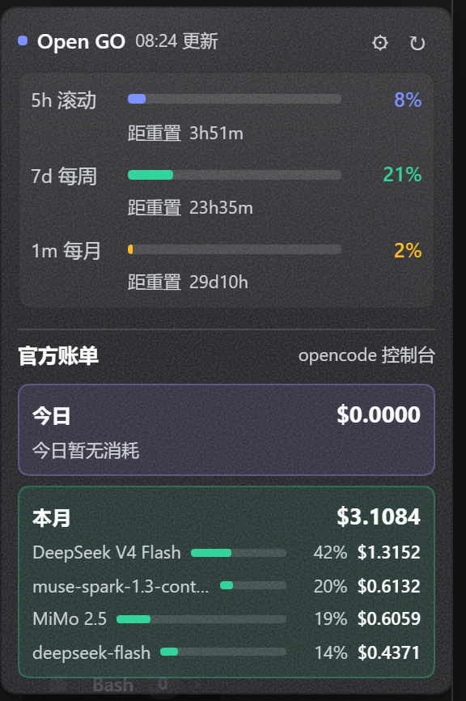
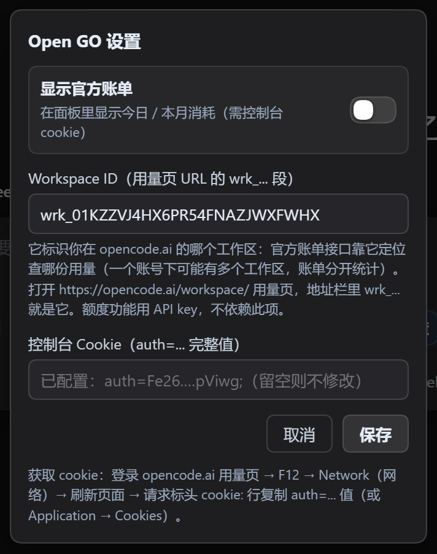
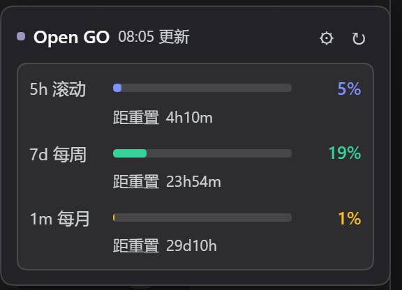

# ⚡ dsh-open-go

Open GO 套餐额度 + 官方账单小组件，挂在 DSH Web 侧边栏**设置按钮上方**（`sidebar.footer.action` 插槽）。

## 功能

**Open GO 额度**（官方 usage 接口）
- 滚动 / 每周 / 每月三档额度百分比条 + 重置时间
- 标题旁显示 24 时制更新时间（如 `17:35 更新`）
- 点击 ↻ **一键刷新全部**（额度 + 账单，跳过缓存），每 5 分钟自动轮询

**官方账单**（opencode 控制台 getCosts RPC，非本地估算）
- **今日**：蓝色块，按模型柱状条（模型名 + 占比% + 金额）
- **本月**：绿色块，按模型柱状条（top 4）
- 金额来自官方控制台，精确到分

**设置面板配置**（当前版本已内置）
- 在 DSH 的「设置 → 插件 → opencode-quota」中直接填写 workspace id 和登录 cookie
- cookie 字段为 secret 类型（密码框显示），凭据只存本地、不出服务器

**窄侧栏**（rail 模式）自动退化为小图标按钮。

## 截图

侧边栏小组件（额度 + 官方账单）：



账单配置弹窗（⚙ 齿轮打开，填写 workspace id 和 cookie）：



组件特写（今日/本月按模型明细）：



## 安装

```sh
# pnpm 9+ 需要 -w（workspace root）标志；dsh 转发器原样透传
dsh plugin --profile web add -w https://github.com/Animal2404/dsh-open-go

# 若报 EPERM（profile 目录在工作区外被沙箱拦截），在允许写入 ~/.dsh 的权限下重试
# 重启 dsh web 生效
```

## 配置凭证

额度功能**零配置**：自动读取 `OPENCODE_GO_API_KEY`（环境变量或 `~/.dsh/.credentials.yaml`），
或回退到 opencode CLI 的 `~/.local/share/opencode/auth.json`（用过 opencode CLI 登录即有）。

官方账单需要两步（一次性，约 2 分钟），**任选一种配置方式**：

### 方式 1：设置面板（推荐，当前版本已内置）

1. DSH Web → 设置 → 插件 → opencode-quota
2. 填写：
   - **workspaceId**：打开 https://opencode.ai/workspace/ 用量页，地址栏里 `wrk_` 开头的那段
   - **consoleCookie**：登录 opencode.ai 后获取 cookie（见下方「获取 cookie」），填 `auth=...` 完整值
3. 保存即生效（无需重启）

> **cookie 格式（重要）**：账单接口吃的就是浏览器实际发送的那串——
> `auth=Fe26.2**...; oc_locale=zh`
> （`auth` 负责认证，`oc_locale=zh` 是浏览器同发的语言 cookie）。从 Network 面板复制 `cookie:` 请求头整行值即可，格式不用自己拼。

> **Workspace ID 是干什么的？**
> 它标识你在 opencode.ai 上的**哪个工作区**。一个账号下可能挂多个工作区（不同项目/组织），
> 每个工作区的用量账单是**分开统计**的——官方账单接口（控制台 getCosts RPC）要靠这个 ID
> 才能定位"该查哪份账单"。所以它必须和 cookie 配套填写。
> 它不含敏感信息（不是密钥）；**额度功能用 API key，不依赖它**，只填 cookie 也能用官方账单。

### 方式 2：凭证文件（~/.dsh/.credentials.yaml）

```yaml
# ① workspace id：用量页 URL 里的 wrk_... 一段
OPENCODE_WORKSPACE_ID: 'wrk_01KZZVJ4HX6PR54FNAZJWXFWHX'

# ② 登录 cookie（登录 opencode.ai 后获取，见下方「获取 cookie」）
OPENCODE_CONSOLE_COOKIE: 'auth=Fe26.2**...; oc_locale=zh'
```

### 获取 cookie（auth 是 httpOnly，JS 读不到，务必用下面几种方式之一）

**方式 A（推荐，F12 Network 面板）**
1. 浏览器登录 https://opencode.ai/workspace/ 用量页，按 F12 打开 **Network（网络）** 面板
2. **刷新页面**（F5），点开任意一个发往 opencode.ai 的请求
3. 在 **Request Headers（请求标头）** 里找到 `cookie:` 行，复制 `auth=...` 这一整段（或整行 cookie 值）
4. 填入设置面板或凭证文件

**方式 B（F12 Application 面板）**
1. 登录 opencode.ai 用量页，F12 → Application → Cookies → `https://opencode.ai`
2. 找到 `auth`，双击 Value 全选复制
3. 拼成 `auth=<复制的值>` 填入

**方式 C（Cookie-Editor 扩展）**
1. 浏览器装 Cookie-Editor 扩展，登录 opencode.ai 后打开扩展
2. 点 Copy（复制全部 cookie），粘贴到设置面板或凭证文件

> ⚠️ 控制台 `copy(document.cookie)` **无效**：auth cookie 是 httpOnly，JS 无法读取。
> 三种方式都能拿到 httpOnly cookie；cookie 是登录会话，**过期后重新复制一次即可**（账单会显示"cookie 可能已过期"提示）。

## 手动验证宿主接口

```powershell
# 额度
Invoke-RestMethod -Uri http://127.0.0.1:3080/dsh-opencode-quota/api/status -Headers @{ 'x-dsh-opencode-quota' = '1' }
# 官方账单（本月按日×模型；?force=1 跳过缓存）
Invoke-RestMethod -Uri http://127.0.0.1:3080/dsh-opencode-quota/api/official -Headers @{ 'x-dsh-opencode-quota' = '1' }
```

## 目录结构

```
lib/index.js    # 宿主：额度 / 账单 RPC / 设置面板注册，凭据不出服务器
lib/client.js   # 浏览器端组件（sidebar.footer.action 插槽）
bin/            # modlens 包装器（可选，识图用量本地记录）
cordis.patch.yml
```

## 说明

- 官方账单走 opencode 控制台的登录会话认证（官方限制，API key 无法访问），所以必须配置 cookie；额度接口用 API key，无需 cookie
- 所有凭据只在宿主侧使用，绝不下发浏览器
- 时间显示为本地时区 24 时制；账单按 +08:00 时区聚合（与控制台页面一致）
- 账单 RPC 自动重试 3 次（抗网络抖动）；cookie 过期时返回明确提示

## 许可

MIT
