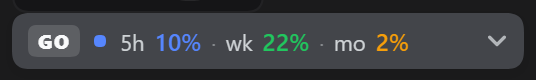

# ⚡ dsh-open-go

Open GO 套餐额度小组件，挂在 DSH Web 侧边栏**设置按钮上方**（`sidebar.footer.action` 插槽）。

## 功能

**收起态 pill**
- 单行读数：`GO` 徽标 + 状态点 + `5h 7% · wk 12% · mo 85%` 三档百分比 + 箭头
- 点它就地展开；开合状态持久化（localStorage）

**展开面板**（额度）
- 三档紧凑行：`5h 滚动` / `7d 每周` / `1m 每月` —— 名称 + 进度条 + 百分比，下面一行 `距重置 2h6m`
- 倒计时每 30 秒自己走（`4h21m` / `1d10h` / `29d10h`）；用量 ≥80% 转橙、≥95% 转红
- 标题旁显示 24 时制更新时间（如 `17:35 更新`）；点 ↻ 一键刷新全部（跳过缓存），每 5 分钟自动轮询

**官方账单**（opencode 控制台 getCosts RPC，非本地估算）——**默认隐藏**
- 在面板右上角 **⚙ 里开关**：打开才显示、也才会请求控制台接口；关掉即停轮询
- **今日**：紫色块，按模型明细（模型名 + 占比% + 金额）；**本月**：绿色块（top 4）
- 金额来自官方控制台，精确到分

**⚙ 弹窗**
- 顶部就是「显示官方账单」开关，下面填 workspace id 与登录 cookie
- 在 DSH 的「设置 → 插件 → opencode-quota」里也能填这两项；cookie 字段为 secret 类型（密码框显示），凭据只存本地、不出服务器

**材质**
- **亚克力**（Acrylic）：面 / 抬升 / 交互全部取 DSH 的语义 token —— pill 用 `--dsw-alias-button-elevated-fill`（与侧边栏「新会话」同款）、面板用 `--dsw-specific-menu`、弹窗用 `--dsw-alias-bg-layer-2`、抬升用 `--dsw-shadow-lv1/2/3`、遮罩用 `--dsw-alias-bg-mask-1`；输入框与按钮直接沿用 `ui-primitives` 的 Input/Button 配方
- **没有模糊、没有噪点、没有自造半透明**（磨砂玻璃那套已下线）：不依赖 `backdrop-filter`，旧浏览器/低配机器上也不掉帧；`rgba()/hex` 只作为 `var()` 的回退值存在
- **不画白描边**：深色侧靠面比底亮分界，浅色侧用 `light-dark(var(--dsw-alias-border-l2), transparent)` 给一条深色细边

**手感/可达性**
- **点开就是立刻展开**：面板当帧上屏（实测 19ms），刷新请求在展开之后才发，绝不挡开合
- 面板弹簧开合、数据变化时数值与进度条平滑补间（真在等数据时才做生长动画）、状态点呼吸、齿轮悬停旋转、箭头旋转变向
- 键盘可达（Tab/Enter/Space 开合、`Esc` 收起）、`role="switch"` 开关、`prefers-reduced-motion` 下全部动效关闭

**窄侧栏**（rail 模式）自动退化为小图标按钮（三根迷你条 + 月度百分比）。

> 视觉规范见 [`UI-SPEC-v0.9.md`](UI-SPEC-v0.9.md)，本机视觉验证记录见 [`.verify/VERIFY-REPORT.md`](.verify/VERIFY-REPORT.md)。

## 截图

收起态（侧边栏「设置」上方）：



展开面板（默认只显示额度）：


⚙ 里的账单开关（打开后才显示官方账单）：


账单打开后的面板（今日 / 本月按模型明细）：


## 安装

```sh
# pnpm 9+ 需要 -w（workspace root）标志；dsh 转发器原样透传
dsh plugin --profile web add -w https://github.com/Animal2404/dsh-open-go

# 若报 EPERM（profile 目录在工作区外被沙箱拦截），在允许写入 ~/.dsh 的权限下重试
# 重启 dsh web 生效
```

## 配置凭证

额度功能**零配置**：自动读取 `OPENCODE_GO_API_KEY`（环境变量或 `~/.dsh/.credentials.yaml`），
或回退到 opencode CLI 的 `~/.local/share/opencode/auth.json`（用过 opencode CLI 登录即有）。

官方账单需要两步（一次性，约 2 分钟），**任选一种配置方式**：

### 方式 1：设置面板（推荐，当前版本已内置）

1. DSH Web → 设置 → 插件 → opencode-quota
2. 填写：
   - **workspaceId**：打开 https://opencode.ai/workspace/ 用量页，地址栏里 `wrk_` 开头的那段
   - **consoleCookie**：登录 opencode.ai 后获取 cookie（见下方「获取 cookie」），填 `auth=...` 完整值
3. 保存即生效（无需重启）

> **cookie 格式（重要）**：账单接口吃的就是浏览器实际发送的那串——
> `auth=Fe26.2**...; oc_locale=zh`
> （`auth` 负责认证，`oc_locale=zh` 是浏览器同发的语言 cookie）。从 Network 面板复制 `cookie:` 请求头整行值即可，格式不用自己拼。

> **Workspace ID 是干什么的？**
> 它标识你在 opencode.ai 上的**哪个工作区**。一个账号下可能挂多个工作区（不同项目/组织），
> 每个工作区的用量账单是**分开统计**的——官方账单接口（控制台 getCosts RPC）要靠这个 ID
> 才能定位"该查哪份账单"。所以它必须和 cookie 配套填写。
> 它不含敏感信息（不是密钥）；**额度功能用 API key，不依赖它**，只填 cookie 也能用官方账单。

### 方式 2：凭证文件（~/.dsh/.credentials.yaml）

```yaml
# ① workspace id：用量页 URL 里的 wrk_... 一段
OPENCODE_WORKSPACE_ID: 'wrk_01KZZVJ4HX6PR54FNAZJWXFWHX'

# ② 登录 cookie（登录 opencode.ai 后获取，见下方「获取 cookie」）
OPENCODE_CONSOLE_COOKIE: 'auth=Fe26.2**...; oc_locale=zh'
```

### 获取 cookie（auth 是 httpOnly，JS 读不到，务必用下面几种方式之一）

**方式 A（推荐，F12 Network 面板）**
1. 浏览器登录 https://opencode.ai/workspace/ 用量页，按 F12 打开 **Network（网络）** 面板
2. **刷新页面**（F5），点开任意一个发往 opencode.ai 的请求
3. 在 **Request Headers（请求标头）** 里找到 `cookie:` 行，复制 `auth=...` 这一整段（或整行 cookie 值）
4. 填入设置面板或凭证文件

**方式 B（F12 Application 面板）**
1. 登录 opencode.ai 用量页，F12 → Application → Cookies → `https://opencode.ai`
2. 找到 `auth`，双击 Value 全选复制
3. 拼成 `auth=<复制的值>` 填入

**方式 C（Cookie-Editor 扩展）**
1. 浏览器装 Cookie-Editor 扩展，登录 opencode.ai 后打开扩展
2. 点 Copy（复制全部 cookie），粘贴到设置面板或凭证文件

> ⚠️ 控制台 `copy(document.cookie)` **无效**：auth cookie 是 httpOnly，JS 无法读取。
> 三种方式都能拿到 httpOnly cookie；cookie 是登录会话，**过期后重新复制一次即可**（账单会显示"cookie 可能已过期"提示）。

## 手动验证宿主接口

```powershell
# 额度
Invoke-RestMethod -Uri http://127.0.0.1:3080/dsh-opencode-quota/api/status -Headers @{ 'x-dsh-opencode-quota' = '1' }
# 官方账单（本月按日×模型；?force=1 跳过缓存）
Invoke-RestMethod -Uri http://127.0.0.1:3080/dsh-opencode-quota/api/official -Headers @{ 'x-dsh-opencode-quota' = '1' }
```

## 目录结构

```
lib/index.js        # 宿主：额度 / 账单 RPC / 设置面板注册，凭据不出服务器
lib/client.js       # 浏览器端组件（sidebar.footer.action 插槽，无构建步骤）
UI-SPEC-v0.9.md     # 视觉规范（参考图对照、token、动效与可达性清单）
.verify/            # 本机视觉验证：无头 Chrome 脚本 + 截图 + 验证报告（不随包发布）
bin/                # modlens 包装器（可选，识图用量本地记录）
cordis.patch.yml
```

## 本地视觉验证

```powershell
cd E:\DeepSeek\dsh-opencode-quota
node .verify\sidebar-check.mjs      # 打开正在运行的 dsh web，截 pill / 面板 / ⚙ 弹窗 / 账单开关，并打印几何探针
```

脚本自己用 `~/.dsh/.credentials.yaml` 里的 `client-connection/browser-session` 密钥签一个 127.0.0.1 会话 cookie，
**不会碰用户正在用的浏览器进程，也不会重启宿主**。

## 说明

- 官方账单走 opencode 控制台的登录会话认证（官方限制，API key 无法访问），所以必须配置 cookie；额度接口用 API key，无需 cookie
- 账单默认隐藏：不打开开关时宿主不会去请求控制台接口（省一次外网请求，也避免 cookie 过期时的无谓报错）
- 所有凭据只在宿主侧使用，绝不下发浏览器
- 时间显示为本地时区 24 时制；账单按 +08:00 时区聚合（与控制台页面一致）
- 账单 RPC 自动重试 3 次（抗网络抖动）；cookie 过期时返回明确提示
- 改了 `lib/client.js` 后浏览器 **Ctrl+Shift+R** 硬刷新即可生效（bundle 带内容哈希，不必重启宿主）

## 许可

MIT
